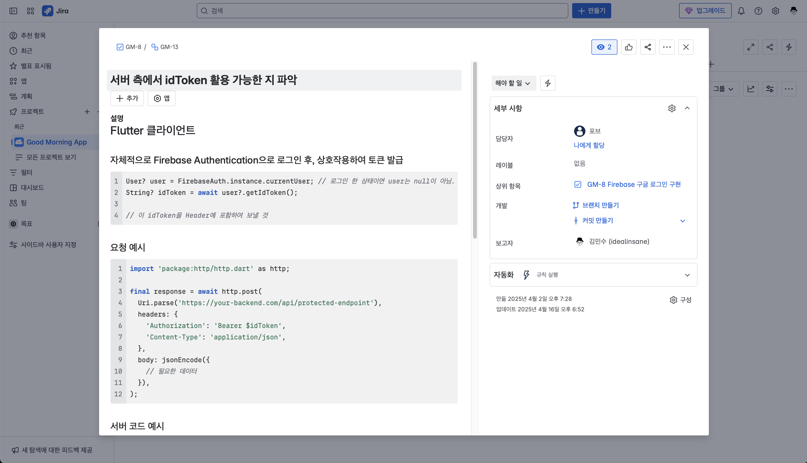

# ☀️ 굿모닝 프로젝트
GoodMorning 프로젝트는 현대 사회에서 고립감을 느끼는 사람들에게 짧고 가벼운 사회적 연결을 제공하는 것을 목표로 합니다.

## 📖 프로젝트 개요

미국의 신경과학자 앤드류 후버만(Andrew Huberman)의 연구에 따르면, 아침에 단순히 "굿모닝"이라는 인사를 주고받는 것만으로도 강하게 연결된 공동체의 일부라는 느낌을 받을 수 있다고 합니다. 이는 우리의 뇌가 사회적 연결을 통해 안정감과 소속감을 얻는 진화적 특성을 가지고 있기 때문입니다.

[](https://www.youtube.com/shorts/glWp9mnVDEk)

이러한 과학적 근거를 바탕으로, 우리는 매일 아침 "굿모닝"이라는 짧은 인사를 주고받을 수 있는 상대를 만들어줌으로써, 사용자가 누군가의 관심을 받고 있다는 소속감과 심리적 안정감을 느낄 수 있도록 설계했습니다.

이 서비스는 장기적이고 깊은 관계보다는, 하루 한 번, 제한된 횟수의 대화(채팅방당 10회)와 24시간 유지되는 채팅방 등 '짧은 관계'에 집중합니다.
이를 통해 지속적인 대화에 부담을 느끼는 사용자, 혹은 일시적으로 사회적 연결이 필요한 사용자를 주요 타겟으로 삼고 있습니다.

특히, 교대 근무자 등 새벽 시간에도 연결이 필요한 글로벌 사용자를 고려하여, 시간과 장소에 구애받지 않는 서비스 확장성을 지향합니다.

## 🎥 시연 영상

[GoodMorning 데모 영상 보러가기](https://youtube.com/shorts/BFB20TLINnk?feature=share)

## ✨ 주요 기능

* **🌍 물리적 환경을 고려한 지구본 UI 채팅 뷰**: 사용자의 실제 위치와 시간에 따라 변화하는 지구본 형태의 인터페이스 위에서 채팅 상대를 확인하고 대화를 시작할 수 있습니다.
* **💬 채팅 히스토리**: 지난 대화 내용을 다시 확인할 수 있는 기능을 제공합니다.
* **👤 프로필 페이지**: 프로필 정보 수정 및 개인화된 설정을 관리할 수 있습니다.

## 🛠 기술 스택

### Frontend
* **Flutter**: 크로스 플랫폼 모바일 앱 개발
* **Firebase**: 인증
* **Riverpod**: 상태 관리

### Backend
* **Fast API**: RESTful API 서버  
([백엔드 레포지토리](https://github.com/pob124/GoodMorning_BackEnd)) (Ctrl+클릭 또는 Cmd+클릭으로 새 창에서 열기)
* **PostgreSQL**: 데이터베이스

### DevOps
* **Docker**: 컨테이너화

## 👥 팀 소개 및 기여

* [김민수](https://github.com/idealinsane) (`idealinsane`) - 서비스 기획, 모바일 앱 개발 (Flutter), UI 디자인
* [구찬서](https://github.com/Koo-CS) (`Koo-CS`) - 서비스 기획, 모바일 앱 개발 (Flutter)
* [홍창현](https://github.com/pob124) (`pob124`) - 서비스 기획, 서버 개발 (Fast API)
* [정현규](https://github.com/oscar2272) (`oscar2272`) - 서버 개발 (Fast API), 프론트 백엔드 연동

## 🤝 협업

굿모닝 프로젝트는 원활한 소통과 효율적인 개발을 위해 다음과 같은 도구를 활용하여 협업합니다.

*   **JIRA**: 이슈 추적 및 프로젝트 관리를 통해 팀원 간의 업무 진행 상황을 공유하고 협업합니다.

    

*   **Swagger API**: API 문서를 명확하게 정의하고 공유하여 프론트엔드와 백엔드 간의 원활한 의사소통을 지원합니다.  
[Swagger API 문서](https://app.swaggerhub.com/apis-docs/MINSUKIM/goodmorning-api/25.05.02) (Ctrl+클릭 또는 Cmd+클릭으로 새 창에서 열기)

## 🚀 시작하기

아래 순서를 따라 프로젝트 환경을 구성하세요.

### 1️. 프로젝트 클론

```bash
git clone https://github.com/idealinsane/GoodMorning.git
cd GoodMorning/
```

### 2️. Firebase 설정

#### 2-1. Firebase 로그인

터미널에서 다음 명령어를 실행해 Firebase에 로그인합니다.

```bash
firebase login
```

#### 2-2. FlutterFire 구성

다음 명령어로 Firebase를 Flutter 프로젝트에 구성합니다.

```bash
flutterfire configure --project=goodmorning-e2072
```


### 3️. env 파일 생성

프로젝트 루트 디렉토리에 `.env` 파일을 생성합니다.

```bash
cp env-template .env
```

`.env` 파일에 필요한 키 값을 입력하세요.


## 굿모닝 프로젝트 작업 디렉토리

````
GoodMorning_Frontend/
├── lib/              # 앱의 주요 소스 코드 (UI, 로직 등)
├── assets/           # 이미지, 폰트 등 정적 리소스
├── android/          # 안드로이드 플랫폼 설정 및 네이티브 연동
├── ios/              # iOS 플랫폼 설정 및 네이티브 연동
├── doc/              # 프로젝트 문서 (선택적 사용)
├── pubspec.yaml      # 의존성 및 assets 설정
└── README.md         # 프로젝트 소개 문서
````


##  이슈 리포트

버그 리포트나 기능 제안은 [GitHub Issues](https://github.com/idealinsane/GoodMorning/issues)를 이용해주세요. (Ctrl+클릭 또는 Cmd+클릭으로 새 창에서 열기)